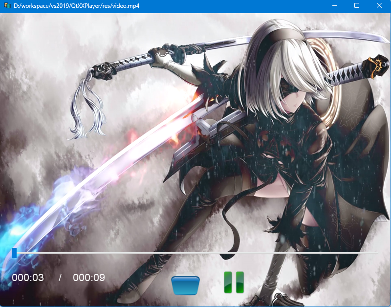

# QtXXPlayer

QtXXPlayer是一款基于qt的视频播放器

<!-- PROJECT SHIELDS -->

[![Contributors][contributors-shield]][contributors-url]
[![Forks][forks-shield]][forks-url]
[![Stargazers][stars-shield]][stars-url]
[![Issues][issues-shield]][issues-url]
[![MIT License][license-shield]][license-url]
[![LinkedIn][linkedin-shield]][linkedin-url]

<!-- PROJECT LOGO -->
<br />

<p align="center">
  <a href="https://github.com/ShiverZm/QtXXPlayer">
    QtXXPlayer
  </a>

  <h3 align="center">一个值得学习的qt播放器</h3>
  <p align="center">
    <br />
    <a href="https://github.com/QtXXPlayer"><strong>探索本项目的文档 »</strong></a>
    <br />
    <br />
    <a href="https://github.com/QtXXPlayer">查看Demo</a>
    ·
    <a href="https://github.com/QtXXPlayer/issues">报告Bug</a>
    ·
    <a href="https://github.com/QtXXPlayer/issues">提出新特性</a>
  </p>

</p>


 本篇README.md面向开发者
 
## 目录

- [QtXXPlayer](#qtxxplayer)
  - [目录](#目录)
    - [上手指南](#上手指南)
          - [开发前的配置要求](#开发前的配置要求)
          - [**安装步骤**](#安装步骤)
    - [文件目录说明](#文件目录说明)
    - [开发的架构](#开发的架构)
    - [部署](#部署)
    - [使用到的框架](#使用到的框架)
    - [贡献者](#贡献者)
      - [如何参与开源项目](#如何参与开源项目)
    - [版本控制](#版本控制)
    - [作者](#作者)
    - [版权说明](#版权说明)
    - [鸣谢](#鸣谢)

### 上手指南



###### 开发前的配置要求

1. visual studio 2019 


###### **安装步骤**

1. Clone the repo
    ``` sh
    git clone https://github.com/ShiverZm/QtXXPlayer.git
    ```
2. 安装[vs-qt-2.8.1插件](https://mirrors.sau.edu.cn/qt/archive/vsaddin/2.8.1/qt-vsaddin-msvc2019-2.8.1-rev.06.vsix)

3. 安装[qt-opensource-windows-x86-5.14.2.exe](https://download.qt.io/archive/qt/5.14/5.14.2/qt-opensource-windows-x86-5.14.2.exe)
   
4. 双击src/XXPlay/XXPlay.sln


### 文件目录说明
eg:

```
filetree 
├── README.md
├── README.en.md
├── LICENSE.txt
├── /images/
├── /bin/
├── /include/
├── /lib/
├── /res/
└── /src/XXPlay/XXPlay.sln

```


### 开发的架构 


### 部署

暂无

### 使用到的框架

- [ffmpeg](https://github.com/FFmpeg/FFmpeg)
- [qt5.14.2](https://download.qt.io/archive/qt/5.14/5.14.2/qt-opensource-windows-x86-5.14.2.exe)

### 贡献者

请阅读**CONTRIBUTING.md** 查阅为该项目做出贡献的开发者。

#### 如何参与开源项目

贡献使开源社区成为一个学习、激励和创造的绝佳场所。你所作的任何贡献都是**非常感谢**的。


1. Fork the Project
2. Create your Feature Branch (`git checkout -b feature/AmazingFeature`)
3. Commit your Changes (`git commit -m 'Add some AmazingFeature'`)
4. Push to the Branch (`git push origin feature/AmazingFeature`)
5. Open a Pull Request


### 版本控制

该项目使用Git进行版本管理。您可以在repository参看当前可用版本。

### 作者

二进制怪兽

微信公众号: binary_monster 

 *您也可以在贡献者名单中参看所有参与该项目的开发者。*

### 版权说明

该项目签署了MIT 授权许可，详情请参阅 [LICENSE.txt](https://github.com/QtXXPlayer/blob/master/LICENSE.txt)

### 鸣谢


- [GitHub Emoji Cheat Sheet](https://www.webpagefx.com/tools/emoji-cheat-sheet)
- [Img Shields](https://shields.io)
- [Choose an Open Source License](https://choosealicense.com)
- [GitHub Pages](https://pages.github.com)
- [Animate.css](https://daneden.github.io/animate.css)

<!-- links -->
[your-project-path]:QtXXPlayer
[contributors-shield]: https://img.shields.io/github/contributors/QtXXPlayer.svg?style=flat-square
[contributors-url]: https://github.com/QtXXPlayer/graphs/contributors
[forks-shield]: https://img.shields.io/github/forks/QtXXPlayer.svg?style=flat-square
[forks-url]: https://github.com/QtXXPlayer/network/members
[stars-shield]: https://img.shields.io/github/stars/QtXXPlayer.svg?style=flat-square
[stars-url]: https://github.com/QtXXPlayer/stargazers
[issues-shield]: https://img.shields.io/github/issues/QtXXPlayer.svg?style=flat-square
[issues-url]: https://img.shields.io/github/issues/QtXXPlayer.svg
[license-shield]: https://img.shields.io/github/license/QtXXPlayer.svg?style=flat-square
[license-url]: https://github.com/QtXXPlayer/blob/master/LICENSE.txt
[linkedin-shield]: https://img.shields.io/badge/-LinkedIn-black.svg?style=flat-square&logo=linkedin&colorB=555
[linkedin-url]: https://linkedin.com/in/shaojintian


